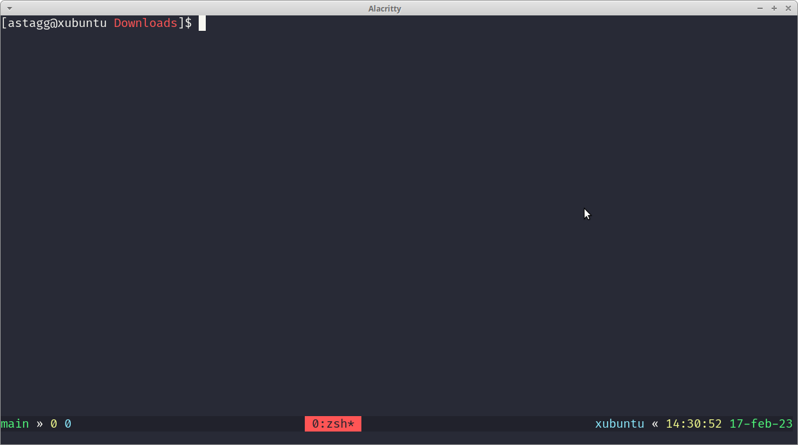

# Bash Mod

zsh theme very similar to default bash theme with a little tweak.

## Install

```shell
$ curl https://raw.githubusercontent.com/pr1s10n3r/bash-mod/master/bash-mod.zsh-theme -o %HOME/.oh-my-zsh/themes
```

Then edit your `.zshrc` file and replace the line `ZSH_THEME="..."` with `ZSH_THEME="bash-mod"`.

## Screenshot


